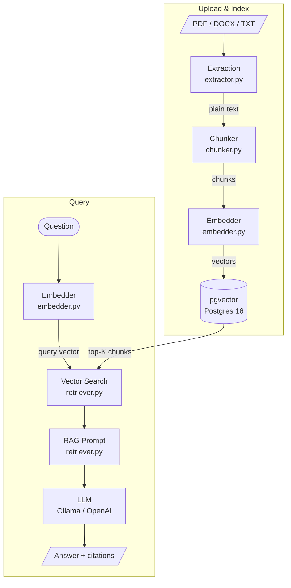

# DocQuery

A local RAG (Retrieval-Augmented Generation) API that lets you upload documents and ask natural-language questions against them. Answers are grounded in the document content and cite the specific passages used.

---

## How it works

### Overview



### 1. Text Extraction

`app/services/extractor.py`

Incoming files are routed by MIME type or extension:

| Format | Library | Notes |
|--------|---------|-------|
| `.txt`, `.md` | built-in | UTF-8 decoded directly |
| `.pdf` | `pypdf` | Heuristic character-stream extraction; tables are flattened to text |
| `.docx` | `python-docx` | Paragraph text only; inline tables are skipped |

> **Limitation:** PDFs containing tables or multi-column layouts are extracted as unstructured text. Cell relationships (row/column) are lost. See the Known Limitations section.

### 2. Chunking

`app/services/chunker.py`

After extraction the full document text is split into overlapping token-bounded chunks using a two-pass strategy:

**Pass 1 — Recursive splitting**

Separators are tried in priority order: `\n\n` → `\n` → `. ` → ` ` → individual characters. If a piece still exceeds `CHUNK_SIZE` tokens after splitting on a separator, the algorithm recurses to the next finer separator. The final fallback is raw token-boundary slicing.

**Pass 2 — Merge with overlap**

The atomic pieces from pass 1 are packed greedily into full-size chunks. When adding the next piece would overflow `CHUNK_SIZE`, the current chunk is flushed and the next one is seeded with the last `CHUNK_OVERLAP` tokens from the flushed chunk. The overlap ensures that a sentence or idea split across a chunk boundary can still be retrieved in either chunk.

Default values (configurable via `.env`):

| Setting | Default | Meaning |
|---------|---------|---------|
| `CHUNK_SIZE` | 512 tokens | Maximum tokens per chunk |
| `CHUNK_OVERLAP` | 50 tokens | Tokens carried forward into the next chunk |

Token counting uses `tiktoken` with the encoding for the configured embedding model (`cl100k_base` for both nomic-embed-text and OpenAI models).

### 3. Embedding

`app/services/embedder.py`

Each chunk is converted to a dense vector. Two providers are supported and swapped via the `EMBEDDING_PROVIDER` env var:

| Provider | Default model | Dimensions | Notes |
|----------|--------------|------------|-------|
| `ollama` (default) | `nomic-embed-text` | 768 | Runs fully locally; requires Ollama |
| `openai` | `text-embedding-3-small` | 1536 | Requires `OPENAI_API_KEY` |

Chunks are sent in batches of 32 to avoid request size limits.

> If you switch providers you must re-create the database (the vector column dimension is fixed at schema creation time in `scripts/init.sql`).

### 4. Vector Storage

`scripts/init.sql`, `app/models/document.py`

Embeddings are stored in PostgreSQL 16 with the `pgvector` extension. The `chunks` table has a `VECTOR(768)` column (or `1536` for OpenAI) indexed with `ivfflat` using cosine distance:

```sql
CREATE INDEX chunks_embedding_idx
    ON chunks USING ivfflat (embedding vector_cosine_ops)
    WITH (lists = 100);
```

`ivfflat` partitions vectors into 100 lists and searches only the nearest lists at query time — fast approximate nearest-neighbor search at the cost of a small recall penalty on very large datasets.

### 5. Retrieval

`app/services/retriever.py`

At query time the question is embedded with the same model used during ingestion. The embedding is compared against all stored chunk vectors using the cosine distance operator (`<=>`). The top-K chunks (default: 5) are returned ordered by similarity score (`1 - cosine_distance`).

### 6. Answer Generation

`app/services/retriever.py` — `_rag_prompt`, `generate_answer`

The retrieved chunks are assembled into a prompt that:

- Presents each chunk as a numbered context section tagged with filename, chunk index, and similarity score
- Instructs the model to answer using **only** the provided context and cite sources inline as `[1]`, `[2]`, etc.
- Tells the model to explicitly say when the context is insufficient rather than hallucinate

Two chat providers are supported via `CHAT_PROVIDER`:

| Provider | Default model | Notes |
|----------|--------------|-------|
| `ollama` (default) | `qwen2.5:14b` | Fully local |
| `openai` | `gpt-4o` | Requires `OPENAI_API_KEY` |

---

## Known Limitations

- **Tables in PDFs** — `pypdf` flattens table cells into plain text. Column/row relationships are not preserved, which can cause the LLM to misattribute numeric values.
- **Scanned PDFs** — image-based PDFs produce no text; OCR is not implemented.
- **DOCX tables** — `python-docx` currently reads paragraph text only; table content is skipped.
- **ivfflat recall** — the approximate index can miss relevant chunks on very large document sets. Consider switching to `hnsw` for higher recall if needed.

---

## Running Locally

### Prerequisites

- Python 3.12+
- Docker (for the database)
- [Ollama](https://ollama.com) — only if using local models (default)

### 1. Clone and install dependencies

```bash
git clone <repo-url>
cd DocQuery
python -m venv .venv
source .venv/bin/activate
pip install -r requirements.txt
```

### 2. Configure environment

```bash
cp .env.example .env
```

Edit `.env` as needed. The defaults run everything locally with Ollama:

```env
EMBEDDING_PROVIDER=ollama
EMBEDDING_MODEL=nomic-embed-text
EMBEDDING_DIMENSIONS=768
CHAT_PROVIDER=ollama
CHAT_MODEL=qwen2.5:14b
OLLAMA_BASE_URL=http://localhost:11434
```

To use OpenAI instead:

```env
EMBEDDING_PROVIDER=openai
EMBEDDING_MODEL=text-embedding-3-small
EMBEDDING_DIMENSIONS=1536
CHAT_PROVIDER=openai
CHAT_MODEL=gpt-4o
OPENAI_API_KEY=sk-...
```

### 3. Pull Ollama models (local mode only)

```bash
ollama pull nomic-embed-text
ollama pull qwen2.5:14b
```

### 4. Start the database

```bash
docker compose up -d
```

This starts a `pgvector/pgvector:pg16` container on port 5432 and runs `scripts/init.sql` on first boot to create the schema and vector index.

### 5. Start the API

```bash
uvicorn main:app --reload
```

The API is available at `http://localhost:8000`. Interactive docs at `http://localhost:8000/docs`.

### 6. Open the UI

Open `index.html` directly in your browser. It connects to `http://localhost:8000` and provides:

- Document upload
- Uploaded document list with delete
- Question input with answer and source citations

### Switching between providers

The embedding dimension is baked into the database schema. If you change `EMBEDDING_PROVIDER` after ingesting documents, drop and recreate the database:

```bash
docker compose down -v   # removes the pgdata volume
# update EMBEDDING_DIMENSIONS in .env
docker compose up -d
```

Then re-upload your documents.

---

## API Reference

| Method | Path | Description |
|--------|------|-------------|
| `GET` | `/health` | Health check |
| `POST` | `/documents/upload` | Upload and index a document |
| `DELETE` | `/documents/{id}` | Delete a document and its chunks |
| `POST` | `/query/` | Ask a question; returns answer + cited chunks |

Full schema available at `http://localhost:8000/docs` when the server is running.
